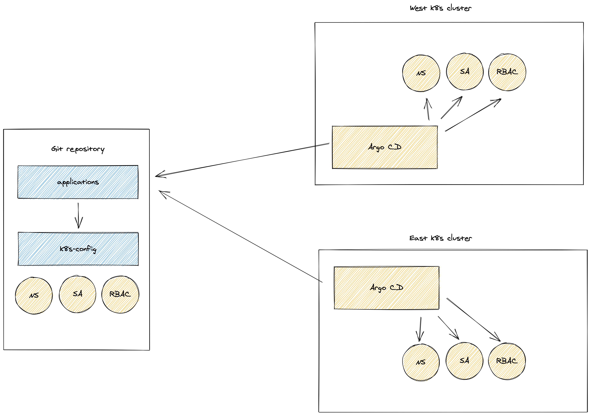
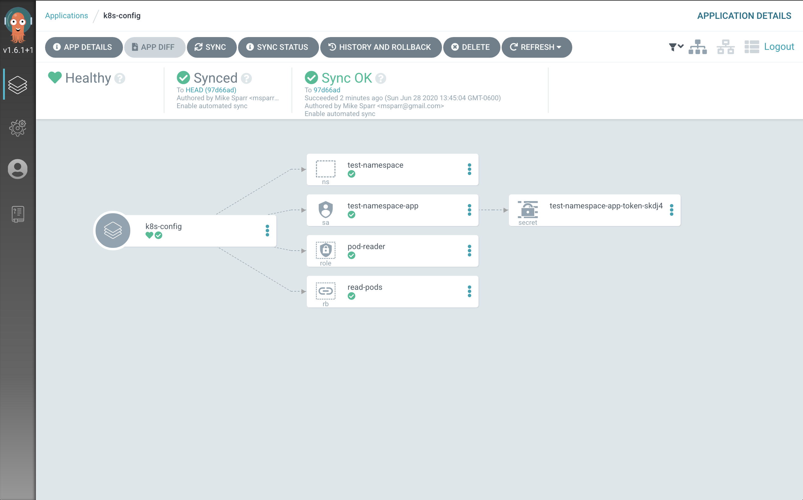
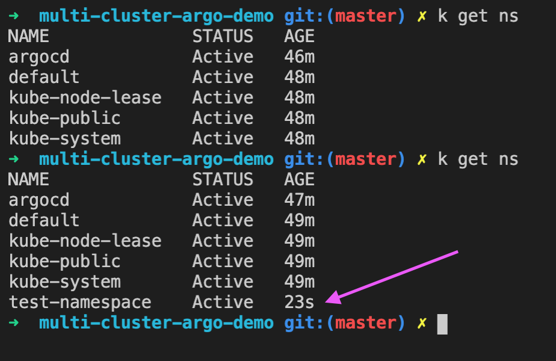

# Argo CD Multi-Cluster Demo
Inspired by Google Anthos Configuration Manager (ACM) I wondered if I could use 
Argo CD and a repository to auto-configure multiple Kubernetes clusters. This 
repo is my sandbox for testing this theory and playing with different features.

# Architecture
The objective is to connect multiple kubernetes clusters via Argo CD to this repo 
and whenever I push changes in this repo, they will automatically apply the changes.



# Usage
1. Create or use an existing Google Cloud Platform project
2. Clone this repository to your computer, cd to `multi-cluster-argo-demo`
3. Create a `.env` file in the same directory as `create-k8s-clusters.sh`
```bash
cat > .env << EOF
export PROJECT_ID=<YOUR PROJECT ID>
export AUTH_NETWORK="<YOUR IP ADDRESS>/32"
EOF
```
4. Execute the bootstrap script `./create-k8s-clusters.sh`
5. Log into your clusters after 8-10 minutes and confirm you have `east` and `west` clusters and Argo CD workloads are installed.


6. Port forward requests to Argo CD server and fetch default password (server pod name)
```bash
# port forward (for now) to access argocd UI
kubectl port-forward svc/argocd-server -n argocd 8080:443 &

# fetch initial password (auto generated)
export ARGO_PASS=$(kubectl get pods -n argocd -l app.kubernetes.io/name=argocd-server -o name | cut -d'/' -f 2)
echo "Argo default pass: ${ARGO_PASS}"
```
7. Open browser to `http://localhost:8080` (accept security warning) and use `admin` and `<PASSWORD FROM ABOVE>` to confirm applications synched

8. Confirm your clusters have the `namespace`, `serviceaccount`, `role`, `rolebinding` declared in the `k8s-config/` folder

9. Create your own repo and change the `app-of-apps.yaml` and `k8s-config.yaml` to point to your repo instead.
10. Enjoy!

# References
- [Cluster Bootstrapping with App of Apps pattern](https://argoproj.github.io/argo-cd/operator-manual/cluster-bootstrapping/)
- [Anthos Config Management](https://cloud.google.com/anthos/config-management) (inspiration)


